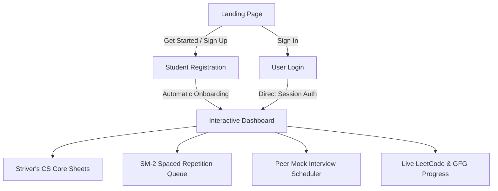
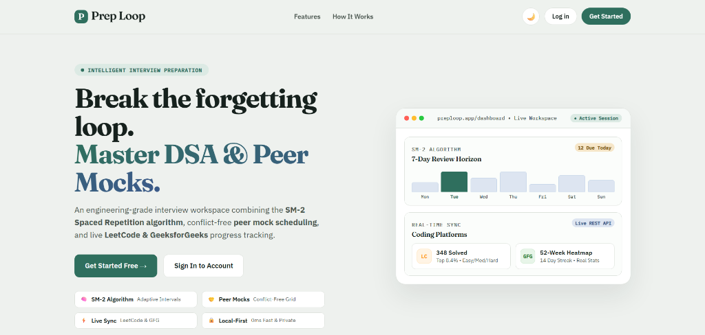
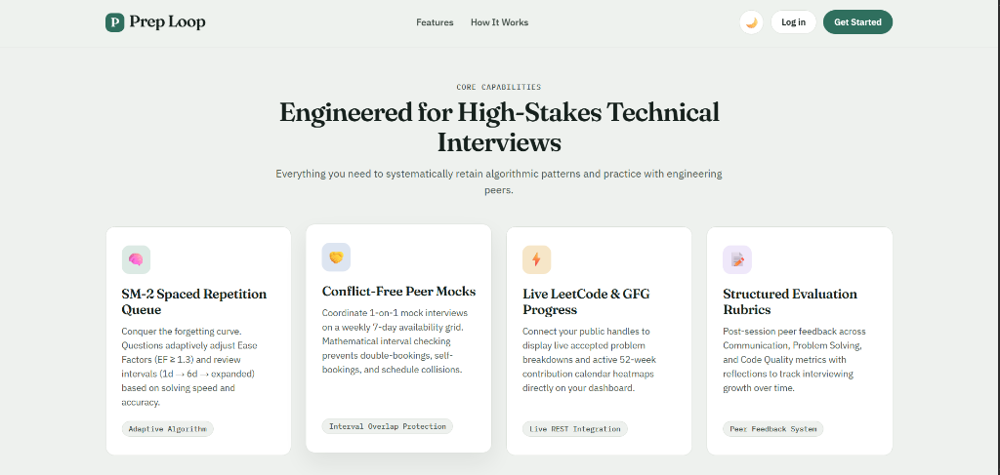
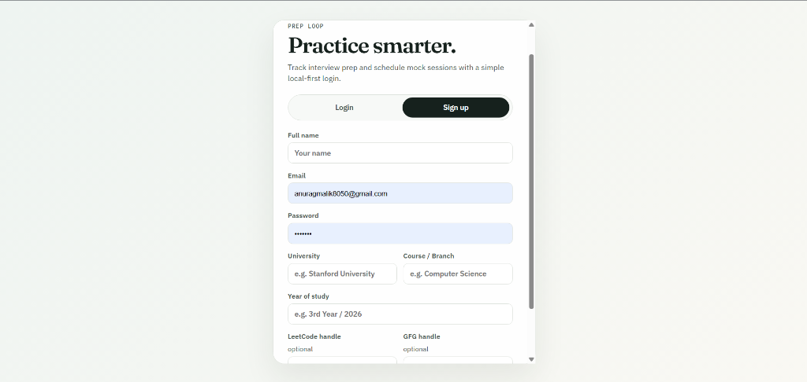
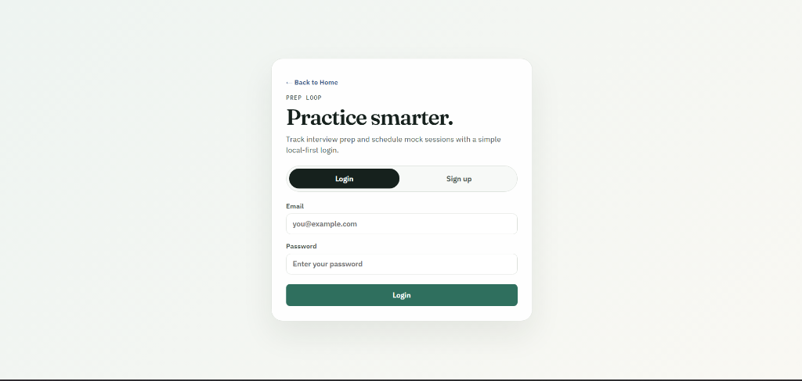
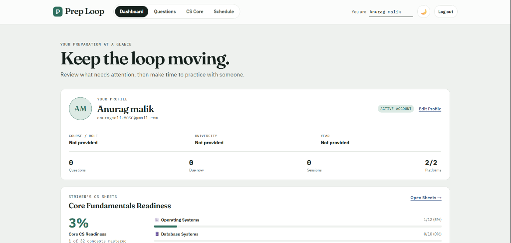
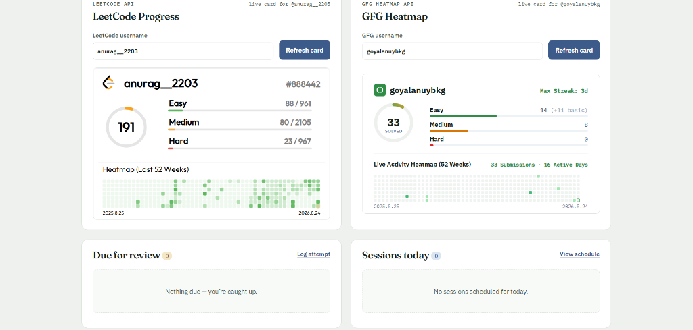
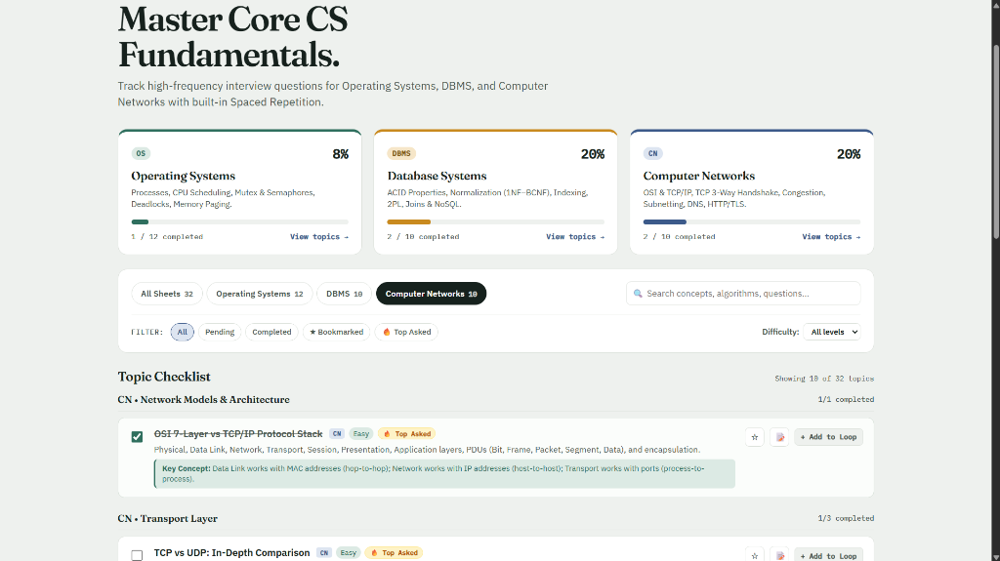
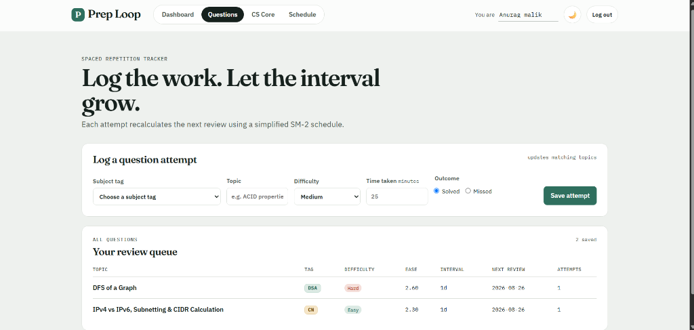
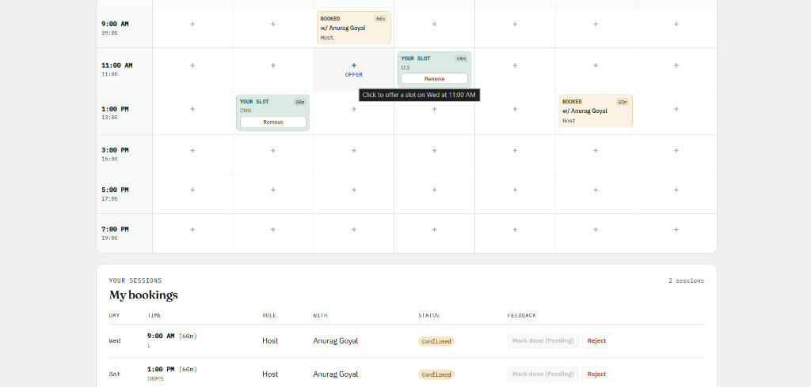

# Prep Loop

> **Intelligent Technical Interview Preparation Workspace & Retention Engine**

Prep Loop is an engineering-grade interview preparation and peer practice tracker designed for computer science students and software engineering candidates. It unifies **SuperMemo SM-2 Spaced Repetition** for algorithmic mastery, **takeUforward (Striver's) Core CS Sheets** for fundamental subjects, **Conflict-Free Peer Mock Interview Scheduling**, and **Live LeetCode & GeeksforGeeks REST Analytics** into a responsive, client-side, local-first web application.

---

## 📸 Application Flow & Visual Walkthrough

Prep Loop provides a friction-free workflow from discovering features to onboarding, tracking algorithmic progress, mastering core computer science subjects, and practicing with engineering peers.



---

### Step 1: Landing Page & Value Proposition

When users first visit the platform, they are greeted by a modern, high-contrast landing page that introduces the core principles of Prep Loop: conquering the forgetting curve, mastering DSA, and practicing live peer mocks.

#### 1. Hero Showcase
The hero section features an interactive live workspace showcase displaying a mini 7-day review horizon chart, live platform indicators, and rapid access to registration.



#### 2. Core Capabilities Breakdown
The landing page highlights the platform's four architectural pillars engineered for high-stakes technical interviews.



- **🧠 SM-2 Spaced Repetition Queue:** Adapts review intervals based on difficulty and solving outcome.
- **🤝 Conflict-Free Peer Mocks:** 7-day weekly schedule matrix with automated overlap prevention.
- **⚡ Live LeetCode & GFG Progress:** Dynamic stats and a 52-week activity heatmap.
- **📝 Structured Evaluation Rubrics:** Post-session peer reviews across Communication, Problem Solving, and Code Quality.

---

### Step 2: Seamless Authentication & Onboarding

Prep Loop features a local-first authentication system that isolates progress, question queues, custom notes, and interview bookings per user account.

#### 1. User Sign Up
New students register with their academic background and optional public coding handles.



- **Mandatory Profile Details:** Full Name, Email, Password, University, Course/Branch, and Year of Study.
- **Optional Coding Handles:** Connect LeetCode and GeeksforGeeks usernames for instant dashboard synchronization.
- **Data Isolation:** Generates an isolated local profile workspace upon registration.

#### 2. User Login
Returning users authenticate with their email and password.



- **Direct Dashboard Routing:** Immediately redirects users to the live workspace dashboard upon logging in.
- **Session Continuity:** Preserves profile details, custom notes, review intervals, and schedule bookings across browser sessions.

---

### Step 3: Interactive Dashboard (Workspace Hub)

The Dashboard acts as the central command center for daily technical interview preparation:

#### 1. Profile Management & Core CS Readiness
Displays user credentials, preparation metrics summary, and an overview of Core CS readiness across Operating Systems, DBMS, and Computer Networks.



- **👤 Student Profile Card:** Displays name, email, university, degree, year, and counts for questions logged, due reviews, and sessions. Includes an editable profile modal with photo upload support.
- **🎯 Core CS Fundamentals Readiness:** Real-time completion bars across Operating Systems, DBMS, and Computer Networks, with smart alerts highlighting high-frequency interview questions.

#### 2. Live Platform Sync & Review Queues
Connects public coding profiles to stream live statistics, problem counts, and 52-week activity heatmaps alongside immediate review queues.



- **⚡ LeetCode Progress Card:** Fetches real-time accepted question counts across Easy, Medium, and Hard tiers along with submission heatmaps via `leetcard.jacoblin.cool`.
- **⚡ GeeksforGeeks Heatmap Card:** Renders total solved count ring, category metrics (Easy, Medium, Hard, Basic), active streaks, and a 52-week submission calendar via the GFG Stats API.
- **⏰ Due for Review Queue:** Shows questions needing immediate review based on the SM-2 algorithm.
- **📅 Today's Sessions:** Highlights confirmed peer mock interviews scheduled for the current day.

---

### Step 4: Striver's (takeUforward) CS Core Sheets

Dedicated interview sheets covering the most frequently asked computer science theory questions across core subjects:



- **3 Core Subjects:**
  - **Operating Systems (12 Topics):** Process States, CPU Scheduling, Mutex vs. Semaphores, Deadlock (Banker's Algorithm), Paging & Virtual Memory.
  - **Database Management Systems (10 Topics):** ACID Properties, Normalization (1NF to BCNF), B/B+ Tree Indexing, Transactions & 2PL, SQL vs. NoSQL.
  - **Computer Networks (10 Topics):** OSI & TCP/IP 7 Layers, TCP 3-Way Handshake, Congestion Control, Subnetting/CIDR, DNS & HTTPS/TLS Handshake.
- **Interactive Checklist:** Mark topics completed, filter by subject, difficulty, or `🔥 Top Asked` interview tags.
- **Revision Notes Drawer:** Expandable notes drawer per topic to store custom mnemonics, formulas, and interview traps.
- **1-Click Loop Integration (`+ Add to Loop`):** Instantly add any CS core topic to the SM-2 Spaced Repetition queue for periodic revision.

---

### Step 5: Spaced Repetition (SM-2) Question Tracker

An implementation of the SuperMemo SM-2 algorithmic workflow for DSA problem retention and pattern recall:



- **Log Question Attempts:** Record subject tag (`DSA`, `DBMS`, `CN`, `OS`), topic name, difficulty (`Easy`, `Medium`, `Hard`), solve duration, and outcome (`Solved` vs. `Missed`).
- **In-Place Deduplication:** Repeated attempts on the same topic update the existing record rather than creating duplicate entries.
- **Dynamic Recalculation:**
  - Updates Ease Factor ($EF \ge 1.3$).
  - Extends intervals ($1\text{d} \to 6\text{d} \to \text{interval} \times EF$).
  - Resets intervals on missed attempts to ensure timely concept recovery.
- **Review Queue Table:** Live tabular view displaying Topic, Subject Tag, Difficulty, Ease Factor, Current Interval, Next Review Date, and Total Attempts.

---

### Step 6: Peer Mock Interview Scheduler

A scheduling engine for 1-on-1 peer mock interviews:



- **Weekly 7-Day Availability Grid:** Interactive matrix covering Monday through Sunday from 07:00 to 22:00.
- **Direct Cell Offering:** Click any open calendar cell (`+ Offer`) to pre-fill and offer a mock session.
- **Custom Duration & Presets:** Choose from 30, 45, 60, or 90-minute session lengths or use 1-click time chips.
- **Mathematical Overlap Protection:** Prevents self-booking, double-booking, and overlapping session collisions.
- **Lifecycle Management:** Role-based controls to confirm, mark done (with session conclusion time validation), reject, or cancel sessions.
- **My Bookings Dashboard:** Chronological list of hosted and requested sessions with direct action controls and post-interview rating rubrics (Communication, Problem Solving, Code Quality on a 1–5 scale).

---

## 🚀 Run Locally

No compilation steps, external servers, or package installations are required.

1. **Clone the repository:**
   ```bash
   git clone https://github.com/AnuragGoyal007/prep-loop.git
   cd prep-loop
   ```

2. **Open directly in your browser:**
   Double-click [`index.html`](index.html) or launch it using any static server:
   ```bash
   # Python 3
   python -m http.server 3000

   # Node.js (npx)
   npx serve .
   ```

3. **Access in browser:** Navigate to `http://localhost:3000`.

---

## 📁 Project Structure

```text
prep-loop/
├── assets/
│   └── screenshots/          # Application walkthrough screenshots
│       ├── landing-hero.png
│       ├── landing-features.png
│       ├── auth-login.png
│       ├── auth-signup.png
│       ├── dashboard-profile.png
│       ├── dashboard-platforms.png
│       ├── cs-core-sheets.png
│       ├── questions-sm2.png
│       └── schedule-grid.png
├── cs_sheets_data.js         # TakeUforward CS Core questions dataset (OS, DBMS, CN)
├── sm2.js                    # Pure SuperMemo SM-2 spaced repetition algorithm
├── scheduler.js              # Pure scheduling & interval conflict-checking logic
├── storage.js                # LocalStorage abstraction & user-isolated caching
├── app.js                    # Main application controller & reactive DOM rendering
├── style.css                 # Custom design tokens, layout grids, and dark theme
├── index.html                # Semantic HTML structure & accessible dialogs
└── README.md                 # Complete documentation & user guide
```

---

## 💾 Local Storage Architecture

All user data persists in browser `localStorage` with safe fallback handling:

| Storage Key | Description |
|---|---|
| `prepLoop.users` | Array of registered user profile objects and credentials |
| `prepLoop.currentUser` | Active authenticated session object |
| `prepLoop.whoami` | Active display name fallback |
| `prepLoop.theme` | Color scheme preference (`light` / `dark`) |
| `prepLoop.questions` | Logged question attempts with SM-2 state and review schedules |
| `prepLoop.csCoreProgress` | Striver's CS Core topic completion, bookmarks, and revision notes |
| `prepLoop.slots` | Offered peer mock availability slots |
| `prepLoop.bookings` | Confirmed mock interview sessions and peer feedback |
| `prepLoop.leetCodeProfiles` | LeetCode usernames mapped per account |
| `prepLoop.gfgProfiles` | GeeksforGeeks handles mapped per account |
| `prepLoop.gfgCache` | Cached GFG stats & heatmap payload for instant loads |

---

## 🛠️ Technology Stack

- **Frontend Core:** Semantic HTML5, Vanilla JavaScript (ES6+), Vanilla CSS3 (Custom Design Tokens, Flexbox, CSS Grid)
- **Typography:** Google Fonts ([Fraunces](https://fonts.google.com/specimen/Fraunces), [IBM Plex Sans](https://fonts.google.com/specimen/IBM+Plex+Sans), [IBM Plex Mono](https://fonts.google.com/specimen/IBM+Plex+Mono))
- **Live APIs:**
  - LeetCode Card API (`leetcard.jacoblin.cool`)
  - GeeksforGeeks REST Stats API (`gfg-stats-api.vercel.app` / `gfg-stats.tashif.codes`)
- **Algorithms:** SM-2 Spaced Repetition, Interval Overlap Mathematical Collision Detection
- **Storage:** Browser LocalStorage with zero external database dependencies

---

## 🔮 Phase 2 Roadmap

Future full-stack extensions for Prep Loop:
- [ ] Express.js / Node.js backend with JWT and OAuth2 integration.
- [ ] MongoDB database for cross-device synchronization and shared interview rooms.
- [ ] WebSockets / WebRTC for live coding rooms, video calls, and instant booking notifications.
- [ ] AI-assisted mock interviewer powered by Gemini for automated code quality and communication feedback.

---

## 📄 License & Course Information

Developed as a **Local-First Web Engineering Course Project (BEE Course - Phase 1)**.  
Released under the [MIT License](LICENSE).
